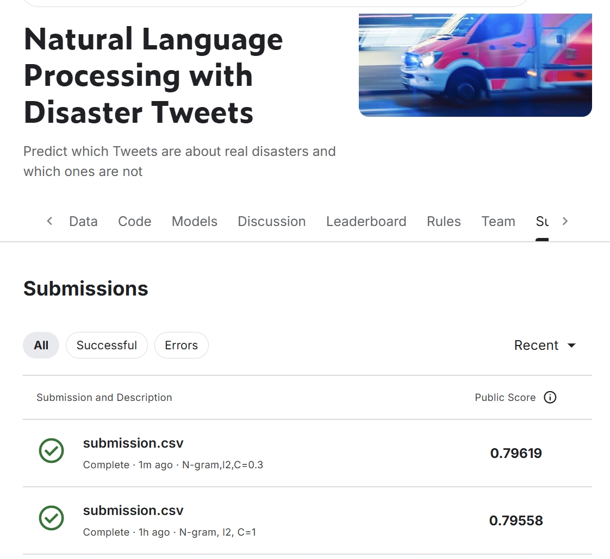

# NLP with Disaster Tweets (Kaggle)

A lightweight NLP baseline for the Kaggle competition **“Natural Language Processing with Disaster Tweets”**:  
predict whether a tweet is about a real disaster (`target=1`) or not (`target=0`).

- Competition: https://www.kaggle.com/competitions/nlp-getting-started
- Kaggle score (public): **0.79619**


---

## Repository files
- `NLP with Disaster Tweets.ipynb`: main notebook (end-to-end pipeline)
- `kaggle.png`: screenshot of Kaggle submission score
- `submission.csv`: generated submission file (id, target)

> Note: Kaggle dataset files (`train.csv`, `test.csv`, `sample_submission.csv`) are not tracked in GitHub.  
> Please download them from the [Kaggle competition page](https://www.kaggle.com/competitions/nlp-getting-started/data) and place them in the current directory.

---

## What I did
### 1) Text preprocessing
- Lowercase
- Remove URLs and @username, remove‘#’
- Normalize extra space and newline
- Remove pure numbers, except 4 digit year like 1987 2001
- Lemmatization (NLTK)

### 2) Experiments
I compared two **Bag-of-Words (BoW)** feature settings:
- **Unigram BoW** (single words)
- **Unigram + Bigram BoW** (N-gram features, `ngram_range=(1,2)`)

Implemented with `CountVectorizer`:
- `min_df=2`
- `stop_words='english'`
- `max_features=5000`

### 3) Model & experiments
Classifier: **Logistic Regression**
- **No regularization** (`penalty=None`)
- **L1 regularization (Lasso)** (`penalty='l1'`)
- **L2 regularization (Ridge)** (`penalty='l2'`)

Model selection:
- Evaluated on a dev set using **F1 score** (also tracked accuracy)
- After selecting the best-performing configuration (**BoW with ngram(1,2) + L2**), tuned regularization strength **`C`** on the dev set  
  Best found: **`C = 0.3`**

### 4) Model interpretation

The figure below shows the top positive and negative coefficients learned by an
L2-regularized Logistic Regression model using Bag-of-Words with unigram and bigram
(ngram_range=(1,2)) features.


---

## How to run

### 1) Install dependencies
```bash
pip install pandas numpy scikit-learn nltk matplotlib
```
### 2) Download Kaggle data `nlp-getting-started.zip`

Download from the competition page and place files in the same directory with `NLP with Disaster Tweets.ipynb`

### 3) Run notebook
Open and run:

- NLP with Disaster Tweets.ipynb

The notebook will generate:

- `submission.csv` (ready to upload to Kaggle)

